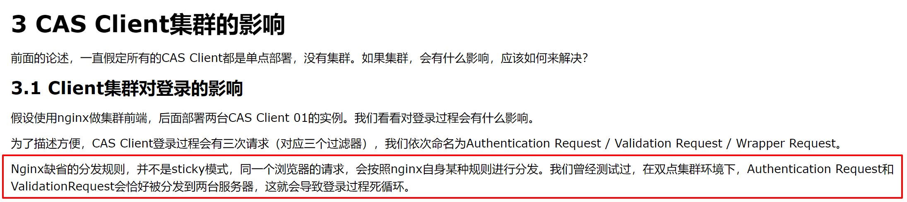

# CAS 客户端部署到测试环境中的问题

Spring Security + Cas 框架基于
https://github.com/woshiamiaojiang/projects/tree/master/casclient_demo3
这套代码实现。
部署到实际环境中，因为需要将cas client的地址改为域名。
但结果因为是两台的集群环境。每次请求都不是一台服务器。校验ticket时正好出现了循环重定向。经排查是由于

http://www.cnblogs.com/codestory/p/5512104.html

真正的解决策略：修改Nginx分发策略为sticky或者ip_hash。确保每次请求的都是同一个服务器。

中途被公司大牛忽悠，将session存储到redis中解决session共享问题。磨了两天多时间，参考了git上的代码

https://github.com/lucasko-tw/spring4mvc-security-session-redis

在windows本机安装了redis，nginx终于测试出。只有ticket验证通过时，才会出现session。根本不是解决问题的办法。
启动redis脚本`redis-server  redis.windows.conf`

启动nginx脚本`start .\nginx.exe`

最后写出来的Spring Security + CAS + Spring Session + Redis代码作为纪念

https://github.com/woshiamiaojiang/projects/tree/master/Spring%20Security%20%2B%20CAS%20%2B%20Spring%20Session%20%2B%20Redis?1545926501646

