# 乐优项目

## 创建父工程

选择maven工程com.leyou.parent

pom文件导入

```xml
<?xml version="1.0" encoding="UTF-8"?>
<project xmlns="http://maven.apache.org/POM/4.0.0" xmlns:xsi="http://www.w3.org/2001/XMLSchema-instance"
	xsi:schemaLocation="http://maven.apache.org/POM/4.0.0 http://maven.apache.org/xsd/maven-4.0.0.xsd">
	<modelVersion>4.0.0</modelVersion>

	<groupId>com.leyou.parent</groupId>
	<artifactId>leyou</artifactId>
	<version>1.0.0-SNAPSHOT</version>
	<packaging>pom</packaging>

	<name>leyou</name>
	<description>Demo project for Spring Boot</description>

	<parent>
		<groupId>org.springframework.boot</groupId>
		<artifactId>spring-boot-starter-parent</artifactId>
        <!-- 原来的版本是2.0.1与actuator冲突 -->
		<version>2.0.4.RELEASE</version>
		<relativePath/> <!-- lookup parent from repository -->
	</parent>

	<properties>
		<project.build.sourceEncoding>UTF-8</project.build.sourceEncoding>
		<project.reporting.outputEncoding>UTF-8</project.reporting.outputEncoding>
		<java.version>1.8</java.version>
        <!-- 原来的Finchley.RC1是错误的 -->
		<spring-cloud.version>Finchley.RELEASE</spring-cloud.version>
		<mybatis.starter.version>1.3.2</mybatis.starter.version>
		<mapper.starter.version>2.0.2</mapper.starter.version>
		<!-- <druid.starter.version>1.1.9</druid.starter.version> -->
		<mysql.version>5.1.32</mysql.version>
		<pageHelper.starter.version>1.2.3</pageHelper.starter.version>
		<leyou.latest.version>1.0.0-SNAPSHOT</leyou.latest.version>
		<fastDFS.client.version>1.26.1-RELEASE</fastDFS.client.version>
	</properties>

	<dependencyManagement>
		<dependencies>
			<!-- springCloud -->
			<dependency>
				<groupId>org.springframework.cloud</groupId>
				<artifactId>spring-cloud-dependencies</artifactId>
				<version>${spring-cloud.version}</version>
				<type>pom</type>
				<scope>import</scope>
			</dependency>
			<!-- mybatis启动器 -->
			<dependency>
				<groupId>org.mybatis.spring.boot</groupId>
				<artifactId>mybatis-spring-boot-starter</artifactId>
				<version>${mybatis.starter.version}</version>
			</dependency>
			<!-- 通用Mapper启动器 -->
			<dependency>
				<groupId>tk.mybatis</groupId>
				<artifactId>mapper-spring-boot-starter</artifactId>
				<version>${mapper.starter.version}</version>
			</dependency>
			<!-- 分页助手启动器 -->
			<dependency>
				<groupId>com.github.pagehelper</groupId>
				<artifactId>pagehelper-spring-boot-starter</artifactId>
				<version>${pageHelper.starter.version}</version>
			</dependency>
			<!-- mysql驱动 -->
			<dependency>
				<groupId>mysql</groupId>
				<artifactId>mysql-connector-java</artifactId>
				<version>${mysql.version}</version>
			</dependency>
			<!--FastDFS客户端-->
			<dependency>
				<groupId>com.github.tobato</groupId>
				<artifactId>fastdfs-client</artifactId>
				<version>${fastDFS.client.version}</version>
			</dependency>
          </dependencies>
	</dependencyManagement>

	<build>
		<plugins>
			<plugin>
				<groupId>org.springframework.boot</groupId>
				<artifactId>spring-boot-maven-plugin</artifactId>
			</plugin>
		</plugins>
	</build>

	<repositories>
		<repository>
			<id>spring-milestones</id>
			<name>Spring Milestones</name>
			<url>https://repo.spring.io/milestone</url>
			<snapshots>
				<enabled>false</enabled>
			</snapshots>
		</repository>
	</repositories>
</project>
```

## 创建EurekaServer

在parent模块添加一个模块

```xml
GroupId com.leyou.common
ArtifactId ly-registry
Version 1.0.0-SNAPSHOT
```

```
Module name: ly-registry
```

添加pom

```xml
<?xml version="1.0" encoding="UTF-8"?>
<project xmlns="http://maven.apache.org/POM/4.0.0"
         xmlns:xsi="http://www.w3.org/2001/XMLSchema-instance"
         xsi:schemaLocation="http://maven.apache.org/POM/4.0.0 http://maven.apache.org/xsd/maven-4.0.0.xsd">
    <parent>
        <artifactId>leyou</artifactId>
        <groupId>com.leyou.parent</groupId>
        <version>1.0.0-SNAPSHOT</version>
    </parent>
    <modelVersion>4.0.0</modelVersion>

    <groupId>com.leyou.common</groupId>
    <artifactId>ly-registry</artifactId>
    <version>1.0.0-SNAPSHOT</version>

    <dependencies>
        <dependency>
            <groupId>org.springframework.cloud</groupId>
            <artifactId>spring-cloud-starter-netflix-eureka-server</artifactId>
        </dependency>
    </dependencies>
</project>
```

添加类com.leyou.LyRegistry

```java
package com.leyou;

import org.springframework.boot.SpringApplication;
import org.springframework.boot.autoconfigure.SpringBootApplication;
import org.springframework.cloud.netflix.eureka.server.EnableEurekaServer;

/**
 * @author miion
 * @create 2018-12-01
 */
@SpringBootApplication
@EnableEurekaServer
public class LyRegistry {
    public static void main(String[] args){
        SpringApplication.run(LyRegistry.class, args);
    }
}
```

添加配置文件application.yml

```yaml
server:
  port: 10086
spring:
  application:
    name: ly-registry
eureka:
  client:
    fetch-registry: false
    register-with-eureka: false
    service-url:
      defaultZone: http://127.0.0.1:${server.port}/eureka
  server:
    enable-self-preservation: false # 关闭自我保护
    eviction-interval-timer-in-ms: 5000 # 每隔5秒进行一次服务列表清理
```

## 创建Zuul网关

在parent模块添加一个模块

```
GroupId com.leyou.common
ArtifactId ly-api-gateway
Version 1.0.0-SNAPSHOT
```

```
Module name: ly-registry
```

添加pom

```xml
<?xml version="1.0" encoding="UTF-8"?>
<project xmlns="http://maven.apache.org/POM/4.0.0"
         xmlns:xsi="http://www.w3.org/2001/XMLSchema-instance"
         xsi:schemaLocation="http://maven.apache.org/POM/4.0.0 http://maven.apache.org/xsd/maven-4.0.0.xsd">
    <parent>
        <artifactId>leyou</artifactId>
        <groupId>com.leyou.parent</groupId>
        <version>1.0.0-SNAPSHOT</version>
    </parent>
    <modelVersion>4.0.0</modelVersion>

    <groupId>com.leyou.common</groupId>
    <artifactId>ly-api-gateway</artifactId>
    <version>1.0.0-SNAPSHOT</version>

    <dependencies>
        <dependency>
            <groupId>org.springframework.cloud</groupId>
            <artifactId>spring-cloud-starter-netflix-zuul</artifactId>
        </dependency>
        <dependency>
            <groupId>org.springframework.cloud</groupId>
            <artifactId>spring-cloud-starter-netflix-eureka-client</artifactId>
        </dependency>
        <!--是springboot提供的微服务检测接口，默认对外提供几个接口：/info-->
        <dependency>
            <groupId>org.springframework.boot</groupId>
            <artifactId>spring-boot-starter-actuator</artifactId>
        </dependency>
    </dependencies>


</project>
```

添加类com.leyou.LyApiGateway

```java
package com.leyou;

import org.springframework.boot.SpringApplication;
import org.springframework.boot.autoconfigure.SpringBootApplication;
import org.springframework.cloud.client.discovery.EnableDiscoveryClient;
import org.springframework.cloud.netflix.zuul.EnableZuulProxy;

/**
 * @author miion
 * @create 2018-12-02
 */
@SpringBootApplication
@EnableDiscoveryClient
@EnableZuulProxy
public class LyApiGateway {
    public static void main(String[] args){
        SpringApplication.run(LyApiGateway.class, args);
    }
}

```

添加application.yml

```yaml
server:
  port: 10010
spring:
  application:
    name: api-gateway
eureka:
  client:
    service-url:
      defaultZone: http://127.0.0.1:10086/eureka
    registry-fetch-interval-seconds: 5
  instance:
    prefer-ip-address: true
    ip-address: 127.0.0.1
    instance-id: ${spring.application.name}:${server.port}
zuul:
  prefix: /api # 添加路由前缀
  retryable: true
ribbon:
  ConnectTimeout: 250 # 连接超时时间(ms)
  ReadTimeout: 2000 # 通信超时时间(ms)
  OkToRetryOnAllOperations: true # 是否对所有操作重试
  MaxAutoRetriesNextServer: 1 # 同一服务不同实例的重试次数
  MaxAutoRetries: 1 # 同一实例的重试次数
hystrix:
  command:
    default:
      execution:
        isolation:
          thread:
            timeoutInMillisecond: 10000 # 熔断超时时长：10000ms
```

## 创建商品微服务

### 创建父工程ly-item

导入pom

```xml
<?xml version="1.0" encoding="UTF-8"?>
<project xmlns="http://maven.apache.org/POM/4.0.0"
         xmlns:xsi="http://www.w3.org/2001/XMLSchema-instance"
         xsi:schemaLocation="http://maven.apache.org/POM/4.0.0 http://maven.apache.org/xsd/maven-4.0.0.xsd">
    <parent>
        <artifactId>leyou</artifactId>
        <groupId>com.leyou.parent</groupId>
        <version>1.0.0-SNAPSHOT</version>
    </parent>
    <modelVersion>4.0.0</modelVersion>

    <groupId>com.leyou.service</groupId>
    <artifactId>ly-item</artifactId>
    <version>1.0.0-SNAPSHOT</version>
    <!-- 打包方式为pom -->
    <packaging>pom</packaging>
</project>
```

### 在父工程下创建ly-item-interface

导入pom

```xml
<?xml version="1.0" encoding="UTF-8"?>
<project xmlns="http://maven.apache.org/POM/4.0.0"
         xmlns:xsi="http://www.w3.org/2001/XMLSchema-instance"
         xsi:schemaLocation="http://maven.apache.org/POM/4.0.0 http://maven.apache.org/xsd/maven-4.0.0.xsd">
    <parent>
        <artifactId>ly-item</artifactId>
        <groupId>com.leyou.service</groupId>
        <version>1.0.0-SNAPSHOT</version>
    </parent>
    <modelVersion>4.0.0</modelVersion>

    <groupId>com.leyou.service</groupId>
    <artifactId>ly-item-interface</artifactId>
    <version>1.0.0-SNAPSHOT</version>

</project>
```

### 在父工程下创建ly-item-service

导入pom

```xml
<?xml version="1.0" encoding="UTF-8"?>
<project xmlns="http://maven.apache.org/POM/4.0.0"
         xmlns:xsi="http://www.w3.org/2001/XMLSchema-instance"
         xsi:schemaLocation="http://maven.apache.org/POM/4.0.0 http://maven.apache.org/xsd/maven-4.0.0.xsd">
    <parent>
        <artifactId>ly-item</artifactId>
        <groupId>com.leyou.service</groupId>
        <version>1.0.0-SNAPSHOT</version>
    </parent>
    <modelVersion>4.0.0</modelVersion>

    <groupId>com.leyou.service</groupId>
    <artifactId>ly-item-service</artifactId>
    <version>1.0.0-SNAPSHOT</version>

    <dependencies>
        <!--web启动器-->
        <dependency>
            <groupId>org.springframework.boot</groupId>
            <artifactId>spring-boot-starter-web</artifactId>
        </dependency>
        <!--Eureka客户端-->
        <dependency>
            <groupId>org.springframework.cloud</groupId>
            <artifactId>spring-cloud-starter-netflix-eureka-client</artifactId>
        </dependency>
        <!-- mybatis启动器 -->
        <dependency>
            <groupId>org.mybatis.spring.boot</groupId>
            <artifactId>mybatis-spring-boot-starter</artifactId>
        </dependency>
        <!-- 通用Mapper启动器 -->
        <dependency>
            <groupId>tk.mybatis</groupId>
            <artifactId>mapper-spring-boot-starter</artifactId>
        </dependency>
        <!-- 分页助手启动器 -->
        <dependency>
            <groupId>com.github.pagehelper</groupId>
            <artifactId>pagehelper-spring-boot-starter</artifactId>
        </dependency>
        <!-- jdbc -->
        <dependency>
            <groupId>org.springframework.boot</groupId>
            <artifactId>spring-boot-starter-jdbc</artifactId>
        </dependency>
        <!-- mysql驱动 -->
        <dependency>
            <groupId>mysql</groupId>
            <artifactId>mysql-connector-java</artifactId>
        </dependency>
        <dependency>
            <groupId>com.leyou.service</groupId>
            <artifactId>ly-item-interface</artifactId>
            <version>${leyou.latest.version}</version>
        </dependency>
        <!-- actuator与springboot2.0.1冲突，将springboot改成2.0.4 -->
        <dependency>
            <groupId>org.springframework.boot</groupId>
            <artifactId>spring-boot-starter-actuator</artifactId>
        </dependency>
    </dependencies>
</project>
```

**注意：actuator与springboot2.0.1冲突，会报循环引用。将顶级父工程的springboot改为2.0.4**

创建类com.leyou.LyItemService.java

```java
package com.leyou;

import org.springframework.boot.SpringApplication;
import org.springframework.boot.autoconfigure.SpringBootApplication;
import org.springframework.cloud.client.discovery.EnableDiscoveryClient;

/**
 * @author miion
 * @create 2018-12-02
 */
@SpringBootApplication
@EnableDiscoveryClient
public class LyItemService {
    public static void main(String[] args){
        SpringApplication.run(LyItemService.class, args);
    }
}
```

创建application.yml

```yaml
server:
  port: 8081
spring:
  application:
    name: item-service
  datasource:
    url: jdbc:mysql://localhost:3306/heima
    username: root
    password: root
    hikari:
      maximum-pool-size: 30
      minimum-idle: 10
eureka:
  client:
    service-url:
      defaultZone: http://127.0.0.1:10086/eureka
  instance:
    lease-renewal-interval-in-seconds: 5 # 每隔5秒发送一次心跳
    lease-expiration-duration-in-seconds: 10 # 10秒不发送就过期
    prefer-ip-address: true
    ip-address: 127.0.0.1
    instance-id: ${spring.application.name}:${server.port}
```

## 测试路由

在api-gateway中修改路由

```yaml
zuul:
  prefix: /api # 添加路由前缀
  retryable: true
  routes:
    item-service: /item/**
```

添加路由

访问http://127.0.0.1:10010/api/item/actuator/info

默认的http://127.0.0.1:10010/api/item-service/actuator/info也存在

## 创建工具类模块

创建ly-common

```xml
<?xml version="1.0" encoding="UTF-8"?>
<project xmlns="http://maven.apache.org/POM/4.0.0"
         xmlns:xsi="http://www.w3.org/2001/XMLSchema-instance"
         xsi:schemaLocation="http://maven.apache.org/POM/4.0.0 http://maven.apache.org/xsd/maven-4.0.0.xsd">
    <parent>
        <artifactId>leyou</artifactId>
        <groupId>com.leyou.parent</groupId>
        <version>1.0.0-SNAPSHOT</version>
    </parent>
    <modelVersion>4.0.0</modelVersion>

    <groupId>com.leyou.common</groupId>
    <artifactId>ly-common</artifactId>
    <version>1.0.0-SNAPSHOT</version>

    <dependencies>
        <!-- https://mvnrepository.com/artifact/javax.servlet/javax.servlet-api -->
        <dependency>
            <groupId>javax.servlet</groupId>
            <artifactId>javax.servlet-api</artifactId>
            <scope>provided</scope>
        </dependency>

        <!--日志包-->
        <dependency>
            <groupId>org.springframework.boot</groupId>
            <artifactId>spring-boot-starter-logging</artifactId>
        </dependency>

        <!-- https://mvnrepository.com/artifact/com.fasterxml.jackson.core/jackson-databind -->
        <dependency>
            <groupId>com.fasterxml.jackson.core</groupId>
            <artifactId>jackson-databind</artifactId>
        </dependency>

        <dependency>
            <groupId>org.springframework.security</groupId>
            <artifactId>spring-security-crypto</artifactId>
            <scope>compile</scope>
        </dependency>

        <dependency>
            <groupId>org.apache.tomcat.embed</groupId>
            <artifactId>tomcat-embed-core</artifactId>
        </dependency>
    </dependencies>
</project>
```

创建文件夹com.leyou.utils

导入五个工具类


## WIN10启动NGINX一闪而过

查看logs下的日志，发现是因为中文目录，移到C盘解决问题。

配置了NGINX却失效的原因。

1.写配置写错了文件，没有生效。

2.nginx缓存导致。任务管理器关闭所有NGINX，重新启动。

### NGINX配置


## 导入数据库失败

不支持mysql5.5版本。卸了，安装mysql5.7msi版本。


## 实现商品分类查询

在`ly-item-interface`中添加category实体类：

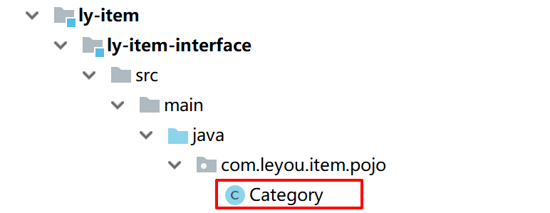

```java
package com.leyou.item.pojo;

import javax.persistence.GeneratedValue;
import javax.persistence.GenerationType;
import javax.persistence.Id;
import javax.persistence.Table;

/**
 * @author miion
 * @create 2018-12-08
 */
@Table(name="tb_category")
public class Category {
    @Id
    @GeneratedValue(strategy= GenerationType.IDENTITY)
    private Long id;
    private String name;
    private Long parentId;
    private Boolean isParent;
    private Integer sort;
    // getter和setter略
    // 注意isParent的get和set方法

    public Long getId() {
        return id;
    }

    public void setId(Long id) {
        this.id = id;
    }

    public String getName() {
        return name;
    }

    public void setName(String name) {
        this.name = name;
    }

    public Long getParentId() {
        return parentId;
    }

    public void setParentId(Long parentId) {
        this.parentId = parentId;
    }

    // 手动将getParent改成getIsParent
    public Boolean getIsParent() {
        return isParent;
    }

    // 手动将setParent改成setIsParent
    public void setIsParent(Boolean parent) {
        isParent = parent;
    }

    public Integer getSort() {
        return sort;
    }

    public void setSort(Integer sort) {
        this.sort = sort;
    }

    @Override
    public String toString() {
        return "Category{" +
                "id=" + id +
                ", name='" + name + '\'' +
                ", parentId=" + parentId +
                ", isParent=" + isParent +
                ", sort=" + sort +
                '}';
    }
}

```

在`ly-item-iterface`中添加jpa依赖

```xml
<dependencies>
    <dependency>
        <groupId>javax.persistence</groupId>
        <artifactId>persistence-api</artifactId>
        <version>1.0</version>
    </dependency>
</dependencies>
```

在`ly-item-service`添加controller，service，mapper

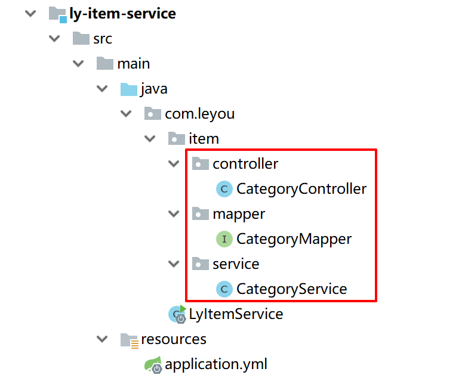

```java
package com.leyou.item.controller;

import com.leyou.item.pojo.Category;
import com.leyou.item.service.CategoryService;
import org.springframework.beans.factory.annotation.Autowired;
import org.springframework.http.HttpStatus;
import org.springframework.http.ResponseEntity;
import org.springframework.web.bind.annotation.GetMapping;
import org.springframework.web.bind.annotation.RequestMapping;
import org.springframework.web.bind.annotation.RequestParam;
import org.springframework.web.bind.annotation.RestController;

import java.util.List;

/**
 * @author miion
 * @create 2018-12-08
 */
@RestController
@RequestMapping("category")
public class CategoryController {

    @Autowired
    private CategoryService categoryService;

    @GetMapping("list")
    public ResponseEntity<List<Category>> queryCategoryByPid(@RequestParam("pid") Long pid) {
        List<Category> list = this.categoryService.queryCategoryByPid(pid);
        if(list == null){
            // 没找到，返回404
            return ResponseEntity.status(HttpStatus.NOT_FOUND).body(null);
        }
        // 找到返回200
        return ResponseEntity.ok(list);
    }

}
```

```java
package com.leyou.item.service;

import com.leyou.item.mapper.CategoryMapper;
import com.leyou.item.pojo.Category;
import org.springframework.beans.factory.annotation.Autowired;
import org.springframework.stereotype.Service;

import java.util.List;

/**
 * @author miion
 * @create 2018-12-08
 */
@Service
public class CategoryService {

    @Autowired
    private CategoryMapper categoryMapper;

    public List<Category> queryCategoryByPid(Long pid) {
        Category category = new Category();
        category.setParentId(pid);
        return this.categoryMapper.select(category);
    }
}
```

```java
package com.leyou.item.mapper;

import com.leyou.item.pojo.Category;
import tk.mybatis.mapper.common.Mapper;

/**
 * @author miion
 * @create 2018-12-08
 */
// 需要添加这个注解，否则报错
@org.apache.ibatis.annotations.Mapper
public interface CategoryMapper extends Mapper<Category> {
}
```

### 测试返回

启动三个服务

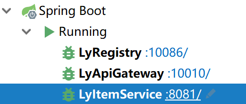

访问http://localhost:8081/category/list?pid=0

http://localhost:10010/api/item/category/list?pid=0

http://api.leyou.com/api/item/category/list?pid=0 有跨域问题

```json
// 20181208120544
// http://localhost:8081/category/list?pid=0

[
  {
    "id": 1,
    "name": "图书、音像、电子书刊",
    "parentId": 0,
    "sort": 1,
    "parent": true
  },
  {
    "id": 74,
    "name": "手机",
    "parentId": 0,
    "sort": 2,
    "parent": true
  },
  {
    "id": 103,
    "name": "家用电器",
    "parentId": 0,
    "sort": 3,
    "parent": true
  },
  {
    "id": 202,
    "name": "数码",
    "parentId": 0,
    "sort": 4,
    "parent": true
  },
  {
    "id": 264,
    "name": "家居家装",
    "parentId": 0,
    "sort": 5,
    "parent": true
  },
  {
    "id": 322,
    "name": "电脑办公",
    "parentId": 0,
    "sort": 6,
    "parent": true
  },
  {
    "id": 417,
    "name": "厨具",
    "parentId": 0,
    "sort": 7,
    "parent": true
  },
  {
    "id": 471,
    "name": "个护化妆",
    "parentId": 0,
    "sort": 8,
    "parent": true
  },
  {
    "id": 548,
    "name": "服饰内衣",
    "parentId": 0,
    "sort": 9,
    "parent": true
  },
  {
    "id": 666,
    "name": "钟表",
    "parentId": 0,
    "sort": 10,
    "parent": true
  },
  {
    "id": 680,
    "name": "鞋靴",
    "parentId": 0,
    "sort": 11,
    "parent": true
  },
  {
    "id": 718,
    "name": "母婴",
    "parentId": 0,
    "sort": 12,
    "parent": true
  },
  {
    "id": 808,
    "name": "礼品箱包",
    "parentId": 0,
    "sort": 13,
    "parent": true
  },
  {
    "id": 871,
    "name": "食品饮料、保健食品",
    "parentId": 0,
    "sort": 14,
    "parent": true
  },
  {
    "id": 931,
    "name": "珠宝",
    "parentId": 0,
    "sort": 15,
    "parent": true
  },
  {
    "id": 1020,
    "name": "汽车用品",
    "parentId": 0,
    "sort": 16,
    "parent": true
  },
  {
    "id": 1117,
    "name": "运动健康",
    "parentId": 0,
    "sort": 17,
    "parent": true
  },
  {
    "id": 1230,
    "name": "玩具乐器",
    "parentId": 0,
    "sort": 18,
    "parent": true
  },
  {
    "id": 1293,
    "name": "彩票、旅行、充值、票务",
    "parentId": 0,
    "sort": 19,
    "parent": true
  },
  {
    "id": 1329,
    "name": "生鲜",
    "parentId": 0,
    "sort": 20,
    "parent": true
  },
  {
    "id": 1401,
    "name": "整车",
    "parentId": 0,
    "sort": 21,
    "parent": true
  }
]
```

### 解决跨域问题

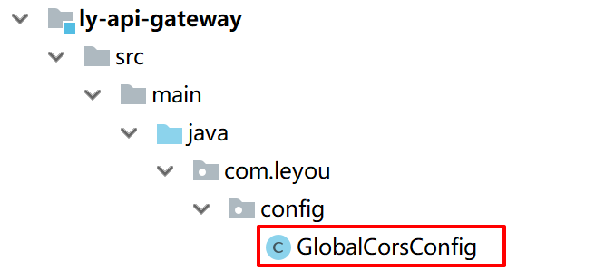

在ly-api-gateway中新建GlobalCorsConfig

```java
package com.leyou.config;

import org.springframework.context.annotation.Bean;
import org.springframework.context.annotation.Configuration;
import org.springframework.web.cors.CorsConfiguration;
import org.springframework.web.cors.UrlBasedCorsConfigurationSource;
import org.springframework.web.filter.CorsFilter;

/**
 * @author miion
 * @create 2018-12-08
 */
@Configuration
public class GlobalCorsConfig {
    @Bean
    public CorsFilter corsFilter() {
        //1.添加CORS配置信息
        CorsConfiguration config = new CorsConfiguration();
        //1) 允许的域,不要写*，否则cookie就无法使用了
        config.addAllowedOrigin("http://manage.leyou.com");
        //2) 是否发送Cookie信息
        config.setAllowCredentials(true);
        //3) 允许的请求方式
        config.addAllowedMethod("OPTIONS");
        config.addAllowedMethod("HEAD");
        config.addAllowedMethod("GET");
        config.addAllowedMethod("PUT");
        config.addAllowedMethod("POST");
        config.addAllowedMethod("DELETE");
        config.addAllowedMethod("PATCH");
        // 4）允许的头信息
        config.addAllowedHeader("*");

        //2.添加映射路径，我们拦截一切请求
        UrlBasedCorsConfigurationSource configSource = new UrlBasedCorsConfigurationSource();
        configSource.registerCorsConfiguration("/**", config);

        //3.返回新的CorsFilter.
        return new CorsFilter(configSource);
    }
}
```

重启三个服务，访问manage.leyou.com

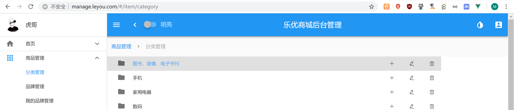

### PO VO BO DTO

| po   | persistence object   | 持久化对象       |
| ---- | -------------------- | ---------------- |
| vo   | view object          | 视图对象         |
| bo   | business object      | 业务对象，多个po |
| DTO  | data transfer object | 数据转移对象     |

## Brand查询

### 建立实体类

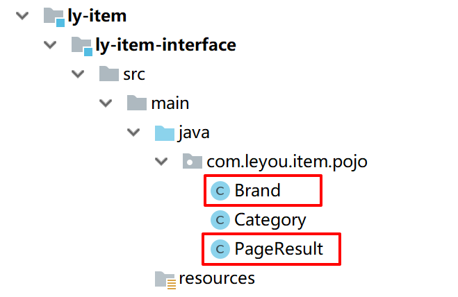

```java
package com.leyou.item.pojo;

import javax.persistence.GeneratedValue;
import javax.persistence.GenerationType;
import javax.persistence.Id;
import javax.persistence.Table;

@Table(name = "tb_brand")
public class Brand {
    @Id
    @GeneratedValue(strategy = GenerationType.IDENTITY)
    private Long id;
    private String name;// 品牌名称
    private String image;// 品牌图片
    private Character letter;
    // getter setter 略

    public Long getId() {
        return id;
    }

    public void setId(Long id) {
        this.id = id;
    }

    public String getName() {
        return name;
    }

    public void setName(String name) {
        this.name = name;
    }

    public String getImage() {
        return image;
    }

    public void setImage(String image) {
        this.image = image;
    }

    public Character getLetter() {
        return letter;
    }

    public void setLetter(Character letter) {
        this.letter = letter;
    }

    @Override
    public String toString() {
        return "Brand{" +
                "id=" + id +
                ", name='" + name + '\'' +
                ", image='" + image + '\'' +
                ", letter=" + letter +
                '}';
    }
}
```

```java
package com.leyou.item.pojo;

import java.util.List;

public class PageResult<T> {
    private Long total;// 总条数
    private Long totalPage;// 总页数
    private List<T> items;// 当前页数据

    public PageResult() {
    }

    public PageResult(Long total, List<T> items) {
        this.total = total;
        this.items = items;
    }

    public PageResult(Long total, Long totalPage, List<T> items) {
        this.total = total;
        this.totalPage = totalPage;
        this.items = items;
    }

    public Long getTotal() {
        return total;
    }

    public void setTotal(Long total) {
        this.total = total;
    }

    public List<T> getItems() {
        return items;
    }

    public void setItems(List<T> items) {
        this.items = items;
    }

    public Long getTotalPage() {
        return totalPage;
    }

    public void setTotalPage(Long totalPage) {
        this.totalPage = totalPage;
    }
}
```

### 添加Controller, Service, Mapper

```java
package com.leyou.item.controller;

import com.leyou.item.pojo.Brand;
import com.leyou.item.pojo.PageResult;
import com.leyou.item.service.BrandService;
import org.springframework.beans.factory.annotation.Autowired;
import org.springframework.http.HttpStatus;
import org.springframework.http.ResponseEntity;
import org.springframework.web.bind.annotation.GetMapping;
import org.springframework.web.bind.annotation.RequestMapping;
import org.springframework.web.bind.annotation.RequestParam;
import org.springframework.web.bind.annotation.RestController;
/**
 * @author miion
 * @create 2018-12-08
 */
@RestController
@RequestMapping("brand")
public class BrandController {

    @Autowired
    private BrandService brandService;

    @GetMapping("page")
    public ResponseEntity<PageResult<Brand>> queryBrandByPage(
            @RequestParam(value = "page", defaultValue = "1") Integer page,
            @RequestParam(value = "rows", defaultValue = "5") Integer rows,
            @RequestParam(value = "sortBy", required = false) String sortBy,
            @RequestParam(value = "desc", defaultValue = "false") Boolean desc,
            @RequestParam(value = "key", required = false) String key) {
        PageResult<Brand> result = this.brandService.queryBrandByPageAndSort(page,rows,sortBy,desc, key);
        if (result == null || result.getItems().size() == 0) {
            return new ResponseEntity<>(HttpStatus.NOT_FOUND);
        }
        return ResponseEntity.ok(result);
    }
}
```

```java
package com.leyou.item.service;

import com.github.pagehelper.Page;
import com.github.pagehelper.PageHelper;
import com.leyou.item.mapper.BrandMapper;
import com.leyou.item.pojo.Brand;
import com.leyou.item.pojo.PageResult;
import org.apache.commons.lang.StringUtils;
import org.springframework.beans.factory.annotation.Autowired;
import org.springframework.stereotype.Service;
import tk.mybatis.mapper.entity.Example;

@Service
public class BrandService {

    @Autowired
    private BrandMapper brandMapper;

    public PageResult<Brand> queryBrandByPageAndSort(
            Integer page, Integer rows, String sortBy, Boolean desc, String key) {
        // 开始分页
        PageHelper.startPage(page, rows);
        // 过滤
        Example example = new Example(Brand.class);
        if (StringUtils.isNotBlank(key)) {
            example.createCriteria().orLike("name", "%" + key + "%")
                    .orEqualTo("letter", key);
        }
        if (StringUtils.isNotBlank(sortBy)) {
            // 排序
            String orderByClause = sortBy + (desc ? " DESC" : " ASC");
            example.setOrderByClause(orderByClause);
        }
        // 查询
        Page<Brand> pageInfo = (Page<Brand>) brandMapper.selectByExample(example);
        // 返回结果
        return new PageResult<>(pageInfo.getTotal(), pageInfo);
    }
}
```

```java
package com.leyou.item.mapper;

import com.leyou.item.pojo.Brand;
import tk.mybatis.mapper.common.Mapper;

/**
 * @author miion
 * @create 2018-12-08
 */
@org.apache.ibatis.annotations.Mapper
public interface BrandMapper extends Mapper<Brand> {
}
```

### 添加跨域请求

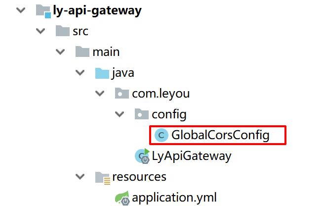

```java
package com.leyou.config;

import org.springframework.context.annotation.Bean;
import org.springframework.context.annotation.Configuration;
import org.springframework.web.cors.CorsConfiguration;
import org.springframework.web.cors.UrlBasedCorsConfigurationSource;
import org.springframework.web.filter.CorsFilter;

/**
 * @author miion
 * @create 2018-12-08
 */
@Configuration
public class GlobalCorsConfig {
    @Bean
    public CorsFilter corsFilter() {
        //1.添加CORS配置信息
        CorsConfiguration config = new CorsConfiguration();
        //1) 允许的域,不要写*，否则cookie就无法使用了
        config.addAllowedOrigin("http://manage.leyou.com");
        //2) 是否发送Cookie信息
        config.setAllowCredentials(true);
        //3) 允许的请求方式
        config.addAllowedMethod("OPTIONS");
        config.addAllowedMethod("HEAD");
        config.addAllowedMethod("GET");
        config.addAllowedMethod("PUT");
        config.addAllowedMethod("POST");
        config.addAllowedMethod("DELETE");
        config.addAllowedMethod("PATCH");
        // 4）允许的头信息
        config.addAllowedHeader("*");

        //2.添加映射路径，我们拦截一切请求
        UrlBasedCorsConfigurationSource configSource = new UrlBasedCorsConfigurationSource();
        configSource.registerCorsConfiguration("/**", config);

        //3.返回新的CorsFilter.
        return new CorsFilter(configSource);
    }
}
```

### 在vue中添加MyBrand.vue

在index.js添加

```js
route("/item/myBrand",'/item/MyBrand',"MyBrand"),
```

在menu.js添加

```js
{ title: "我的品牌管理", path: "/myBrand" },
```

添加MyBrand.vue

```vue
<template>
  <v-card>
    <v-card-title class="layout row">
      <v-btn color="primary">
        新增品牌
      </v-btn>
      <v-spacer/>
      <!--搜索框，与search属性关联-->
      <v-text-field
        label="输入关键字搜索"
        append-icon="search"
        single-line
        hide-details
        class="flex sm3"
        v-model="search"
      />
    </v-card-title>
    <v-divider/>
    <!--<v-btn color="primary">新增</v-btn>-->
    <v-data-table
      :headers="headers"
      :items="brands"
      :pagination.sync="pagination"
      :total-items="totalBrands"
      :loading="loading"
      class="elevation-1"
    >
      <template slot="items" slot-scope="props">
        <td class="text-xs-center">{{ props.item.id }}</td>
        <td class="text-xs-center">{{ props.item.name }}</td>
        <td class="text-xs-center"></td>
        <td class="text-xs-center">{{ props.item.letter }}</td>
        <!--<td class="justify-center layout px-0" >-->
        <!--<v-btn small icon class="mx-0" @click="editItem(props.item)">-->
        <!--<v-icon color="success">edit</v-icon>-->
        <!--</v-btn>-->
        <!--<v-btn small icon class="mx-0" @click="deleteItem(props.item)">-->
        <!--<v-icon color="pink">delete</v-icon>-->
        <!--</v-btn>-->
        <!--</td>-->
        <td class="justify-center layout">
          <v-btn color="info">编辑</v-btn>
          <v-btn color="warning">删除</v-btn>
        </td>
      </template>
    </v-data-table>
  </v-card>
</template>

<script>
  export default {
    name: "my-brand",
    data() {
      return {
        headers: [
          {text: "id", value: "id", align: 'center', sortable: true},
          {text: "名称", value: "name", align: 'center', sortable: true},
          {text: "LOGO", value: "image", align: 'center', sortable: true},
          {text: "首字母", value: "letter", align: 'center', sortable: true},
          {text: "操作", align: 'center', sortable: true}
        ],
        brands: [],
        pagination: {},
        totalBrands: 0,
        loading: false,
        search: ''
      }
    },
    watch: {
      pagination: {
        deep: true,
        handler() {
          this.getDataFromServer();
        }
      },
      search() {
        this.getDataFromServer();
      }
    },
    created() {
      this.getDataFromServer();
    },
    methods: {
      getDataFromServer() {
        // 开启进度条
        this.loading = true;

        // 发起ajax请求
        // page,rows,key,sortBy,desc
        this.$http.get("/item/brand/page",{
          params:{
            key: this.search, // 搜索条件
            page: this.pagination.page,// 当前页
            rows: this.pagination.rowsPerPage,// 每页大小
            sortBy: this.pagination.sortBy,// 排序字段
            desc: this.pagination.descending// 是否降序
          }
        }).then(resp => { // 这里使用箭头函数
          // 将得到的数据赋值给本地属性
          this.brands = resp.data.items;
          this.totalBrands = resp.data.total;
          // 完成赋值后，把加载状态赋值为false
          this.loading = false;
        })
      }
    }
  }
</script>

<style scoped>

</style>
```

### 测试

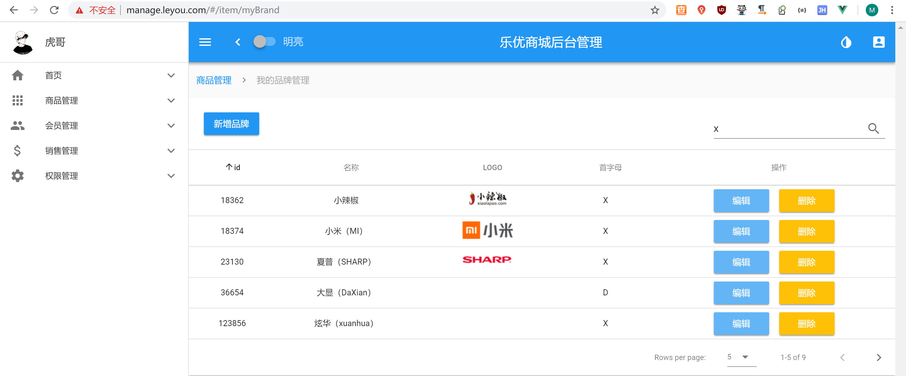

## 新增品牌

### 添加实体类Brand

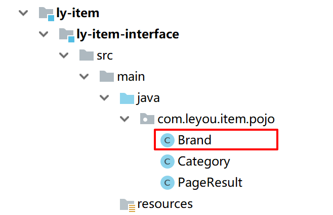

```java
package com.leyou.item.pojo;

import javax.persistence.GeneratedValue;
import javax.persistence.GenerationType;
import javax.persistence.Id;
import javax.persistence.Table;

@Table(name = "tb_brand")
public class Brand {
    @Id
    @GeneratedValue(strategy = GenerationType.IDENTITY)
    private Long id;
    private String name;// 品牌名称
    private String image;// 品牌图片
    private Character letter;
    // getter setter 略

    public Long getId() {
        return id;
    }

    public void setId(Long id) {
        this.id = id;
    }

    public String getName() {
        return name;
    }

    public void setName(String name) {
        this.name = name;
    }

    public String getImage() {
        return image;
    }

    public void setImage(String image) {
        this.image = image;
    }

    public Character getLetter() {
        return letter;
    }

    public void setLetter(Character letter) {
        this.letter = letter;
    }

    @Override
    public String toString() {
        return "Brand{" +
                "id=" + id +
                ", name='" + name + '\'' +
                ", image='" + image + '\'' +
                ", letter=" + letter +
                '}';
    }
}
```

### 添加Controller，Service，Mapper

```java
package com.leyou.item.controller;

import com.leyou.item.pojo.Brand;
import com.leyou.item.pojo.PageResult;
import com.leyou.item.service.BrandService;
import org.springframework.beans.factory.annotation.Autowired;
import org.springframework.http.HttpStatus;
import org.springframework.http.ResponseEntity;
import org.springframework.web.bind.annotation.*;

import java.util.List;

/**
 * @author miion
 * @create 2018-12-08
 */
@RestController
@RequestMapping("brand")
public class BrandController {

    @Autowired
    private BrandService brandService;

    @GetMapping("page")
    public ResponseEntity<PageResult<Brand>> queryBrandByPage(
            @RequestParam(value = "page", defaultValue = "1") Integer page,
            @RequestParam(value = "rows", defaultValue = "5") Integer rows,
            @RequestParam(value = "sortBy", required = false) String sortBy,
            @RequestParam(value = "desc", defaultValue = "false") Boolean desc,
            @RequestParam(value = "key", required = false) String key) {
        PageResult<Brand> result = this.brandService.queryBrandByPageAndSort(page,rows,sortBy,desc, key);
        if (result == null || result.getItems().size() == 0) {
            return new ResponseEntity<>(HttpStatus.NOT_FOUND);
        }
        return ResponseEntity.ok(result);
    }

    /**
     * 新增品牌
     * @param brand
     * @return
     */
    @PostMapping
    public ResponseEntity<Void> saveBrand(Brand brand, @RequestParam("categories") List<Long> ids) {
        this.brandService.saveBrand(brand, ids);
        return new ResponseEntity<>(HttpStatus.CREATED);
    }
}
```

```java
package com.leyou.item.service;

import com.github.pagehelper.Page;
import com.github.pagehelper.PageHelper;
import com.leyou.item.mapper.BrandMapper;
import com.leyou.item.pojo.Brand;
import com.leyou.item.pojo.PageResult;
import org.apache.commons.lang.StringUtils;
import org.springframework.beans.factory.annotation.Autowired;
import org.springframework.stereotype.Service;
import org.springframework.transaction.annotation.Transactional;
import tk.mybatis.mapper.entity.Example;

import java.util.List;

@Service
public class BrandService {

    @Autowired
    private BrandMapper brandMapper;

    public PageResult<Brand> queryBrandByPageAndSort(
            Integer page, Integer rows, String sortBy, Boolean desc, String key) {
        // 开始分页
        PageHelper.startPage(page, rows);
        // 过滤
        Example example = new Example(Brand.class);
        if (StringUtils.isNotBlank(key)) {
            example.createCriteria().orLike("name", "%" + key + "%")
                    .orEqualTo("letter", key);
        }
        if (StringUtils.isNotBlank(sortBy)) {
            // 排序
            String orderByClause = sortBy + (desc ? " DESC" : " ASC");
            example.setOrderByClause(orderByClause);
        }
        // 查询
        Page<Brand> pageInfo = (Page<Brand>) brandMapper.selectByExample(example);
        // 返回结果
        return new PageResult<>(pageInfo.getTotal(), pageInfo);
    }

    @Transactional
    public void saveBrand(Brand brand, List<Long> cids) {
        // 新增品牌信息
        this.brandMapper.insertSelective(brand);
        // 新增品牌和分类中间表
        for (Long cid : cids) {
            this.brandMapper.insertCategoryBrand(cid, brand.getId());
        }
    }
}
```

```java
package com.leyou.item.mapper;

import com.leyou.item.pojo.Brand;
import org.apache.ibatis.annotations.Insert;
import org.apache.ibatis.annotations.Param;
import tk.mybatis.mapper.common.Mapper;

/**
 * @author miion
 * @create 2018-12-08
 */
@org.apache.ibatis.annotations.Mapper
public interface BrandMapper extends Mapper<Brand> {
    /**
     * 新增商品分类和品牌中间表数据
     * @param cid 商品分类id
     * @param bid 品牌id
     * @return
     */
    @Insert("INSERT INTO tb_category_brand (category_id, brand_id) VALUES (#{cid},#{bid})")
    int insertCategoryBrand(@Param("cid") Long cid, @Param("bid") Long bid);
}
```

### 修改Brand.vue

``` vue
<template>
  <v-card>
    <v-card-title class="layout row">
      <v-btn color="primary" @click="show = true">
        新增品牌
      </v-btn>
      <v-spacer/>
      <!--搜索框，与search属性关联-->
      <v-text-field
        label="输入关键字搜索"
        append-icon="search"
        single-line
        hide-details
        class="flex sm3"
        v-model="search"
      />
    </v-card-title>
    <v-divider/>
    <!--<v-btn color="primary">新增</v-btn>-->
    <v-data-table
      :headers="headers"
      :items="brands"
      :pagination.sync="pagination"
      :total-items="totalBrands"
      :loading="loading"
      class="elevation-1"
    >
      <template slot="items" slot-scope="props">
        <td class="text-xs-center">{{ props.item.id }}</td>
        <td class="text-xs-center">{{ props.item.name }}</td>
        <td class="text-xs-center"></td>
        <td class="text-xs-center">{{ props.item.letter }}</td>
        <!--<td class="justify-center layout px-0" >-->
        <!--<v-btn small icon class="mx-0" @click="editItem(props.item)">-->
        <!--<v-icon color="success">edit</v-icon>-->
        <!--</v-btn>-->
        <!--<v-btn small icon class="mx-0" @click="deleteItem(props.item)">-->
        <!--<v-icon color="pink">delete</v-icon>-->
        <!--</v-btn>-->
        <!--</td>-->
        <td class="justify-center layout">
          <v-btn color="info">编辑</v-btn>
          <v-btn color="warning">删除</v-btn>
        </td>
      </template>
    </v-data-table>
    <!--弹出的对话框-->
    <v-dialog max-width="500" v-model="show" scrollable persistent>
      <v-card>
        <!--对话框的标题-->
        <v-toolbar dense color="primary" dark class="title px-2">
          <span>新增品牌</span>
          <v-spacer/>
          <v-btn icon @click="show = false">
            <v-icon>close</v-icon>
          </v-btn>
        </v-toolbar>
        <!--对话框的内容，表单-->
        <v-card-text style="height: 600px;" class="px-5">
          <my-brand-form/>
        </v-card-text>
      </v-card>
    </v-dialog>
  </v-card>
</template>

<script>
  import MyBrandForm from "./MyBrandForm";
  export default {
    name: "my-brand",
    components: {MyBrandForm},
    data() {
      return {
        headers: [
          {text: "id", value: "id", align: 'center', sortable: true},
          {text: "名称", value: "name", align: 'center', sortable: true},
          {text: "LOGO", value: "image", align: 'center', sortable: true},
          {text: "首字母", value: "letter", align: 'center', sortable: true},
          {text: "操作", align: 'center', sortable: true}
        ],
        brands: [],
        pagination: {},
        totalBrands: 0,
        loading: false,
        search: '',
        show: false // 窗口显示
      }
    },
    watch: {
      pagination: {
        deep: true,
        handler() {
          this.getDataFromServer();
        }
      },
      search() {
        this.getDataFromServer();
      }
    },
    created() {
      this.getDataFromServer();
    },
    methods: {
      getDataFromServer() {
        // 开启进度条
        this.loading = true;

        // 发起ajax请求
        // page,rows,key,sortBy,desc
        this.$http.get("/item/brand/page", {
          params: {
            key: this.search, // 搜索条件
            page: this.pagination.page,// 当前页
            rows: this.pagination.rowsPerPage,// 每页大小
            sortBy: this.pagination.sortBy,// 排序字段
            desc: this.pagination.descending// 是否降序
          }
        }).then(resp => { // 这里使用箭头函数
          // 将得到的数据赋值给本地属性
          this.brands = resp.data.items;
          this.totalBrands = resp.data.total;
          // 完成赋值后，把加载状态赋值为false
          this.loading = false;
        })
      }
    },
    comments:{
      MyBrandForm
    }
  }
</script>

<style scoped>

</style>
```

### 添加MyBrandForm.vue

```vue
<template>
  <v-form v-model="valid" ref="brandForm">
    <v-text-field v-model="brand.name" label="品牌名称" required
                  :rules="[v => !!v || '品牌名称不能为空']"
    />
    <v-text-field v-model="brand.letter" label="品牌首字母" required
                  mask="A" :rules="[v => !!v || '品牌首字母不能为空']"
    />
    <v-cascader
      url="/item/category/list"
      multiple required
      v-model="brand.categories"
      label="请选择商品分类"/>
    <v-layout row>
      <v-flex xs4 class="subheader">
        品牌LOGO：
      </v-flex>
      <v-flex>
        <v-upload
          v-model="brand.image"
          url="/item/upload"
          :multiple="false"
          :pic-width="250"
          :pic-height="90"
        />
      </v-flex>
    </v-layout>
    <v-layout row class="pt-5">
      <v-spacer/>
      <v-btn color="primary" @click="submit">提交</v-btn>
      <v-btn color="warning">重置</v-btn>
    </v-layout>
  </v-form>
</template>

<script>
  export default {
    name: "my-brand-form",
    data() {
      return {
        valid: false,
        brand: {
          name: "",
          letter: "",
          image: "",
          categories: [],
        }
      }
    },
    methods:{
      submit(){
        if(this.$refs.brandForm.validate()){
          // 结构表达式获取品牌中的数据，除了categories以外的都存储到rest中
          const {categories, ... rest} = this.brand;
          // 对categories进行处理，得到里面的id，赋值给rest中的categories
          rest.categories = categories.map(c => c.id).join(",");
          // 提交rest
          this.$http.post("/item/brand", this.$qs.stringify(rest))
            .then(resp => {
              console.log("新增成功");
            })
            .catch(() => {
              console.log("新增失败");
            })
        }
      }
    }
  }
</script>

<style scoped>

</style>
```

### 数据库插入数据显示??

修改数据库连接 jdbc:mysql://127.0.0.1:3306/heima?characterEncoding=UTF-8&useSSL=false

### 测试

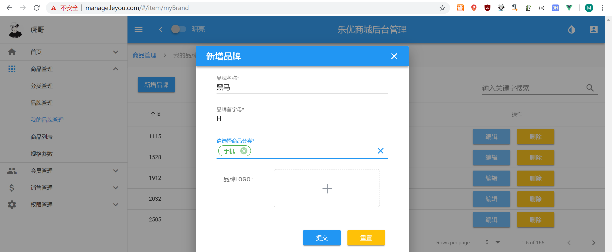

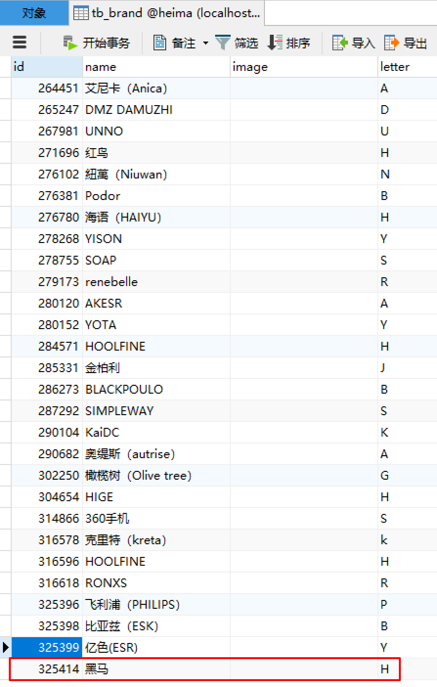

## 上传图片

### 创建新项目ly-upload

```xml
<?xml version="1.0" encoding="UTF-8"?>
<project xmlns="http://maven.apache.org/POM/4.0.0"
         xmlns:xsi="http://www.w3.org/2001/XMLSchema-instance"
         xsi:schemaLocation="http://maven.apache.org/POM/4.0.0 http://maven.apache.org/xsd/maven-4.0.0.xsd">
    <parent>
        <artifactId>leyou</artifactId>
        <groupId>com.leyou.parent</groupId>
        <version>1.0.0-SNAPSHOT</version>
    </parent>
    <modelVersion>4.0.0</modelVersion>

    <groupId>com.leyou.service</groupId>
    <artifactId>ly-upload</artifactId>
    <version>1.0.0-SNAPSHOT</version>

    <dependencies>
        <dependency>
            <groupId>org.springframework.cloud</groupId>
            <artifactId>spring-cloud-starter-netflix-eureka-client</artifactId>
        </dependency>
        <dependency>
            <groupId>org.springframework.boot</groupId>
            <artifactId>spring-boot-starter-web</artifactId>
        </dependency>
    </dependencies>
</project>
```

### 创建启动类

```java
package com.leyou;

import org.springframework.boot.SpringApplication;
import org.springframework.boot.autoconfigure.SpringBootApplication;
import org.springframework.cloud.client.discovery.EnableDiscoveryClient;

/**
 * @author miion
 * @create 2018-12-09
 */
@SpringBootApplication
@EnableDiscoveryClient
public class LyUploadService {
    public static void main(String[] args) {
        SpringApplication.run(LyUploadService.class, args);
    }
}
```

### 写配置文件

```yaml
server:
  port: 8082
spring:
  application:
    name: upload-service
  servlet:
    multipart:
      max-file-size: 5MB # 限制文件上传的大小
# Eureka
eureka:
  client:
    service-url:
      defaultZone: http://127.0.0.1:10086/eureka
  instance:
    lease-renewal-interval-in-seconds: 5 # 每隔5秒发送一次心跳
    lease-expiration-duration-in-seconds: 10 # 10秒不发送就过期
    prefer-ip-address: true
    ip-address: 127.0.0.1
    instance-id: ${spring.application.name}:${server.port}
```

### 创建Controller与Service 

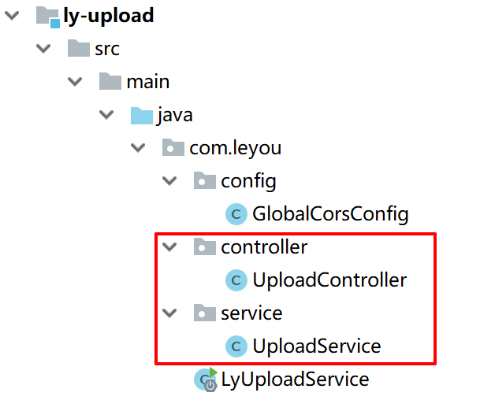

```java
package com.leyou.controller;

import com.leyou.service.UploadService;
import org.apache.commons.lang3.StringUtils;
import org.springframework.beans.factory.annotation.Autowired;
import org.springframework.http.HttpStatus;
import org.springframework.http.ResponseEntity;
import org.springframework.web.bind.annotation.PostMapping;
import org.springframework.web.bind.annotation.RequestMapping;
import org.springframework.web.bind.annotation.RequestParam;
import org.springframework.web.bind.annotation.RestController;
import org.springframework.web.multipart.MultipartFile;

/**
 * @author miion
 */
@RestController
@RequestMapping("upload")
public class UploadController {

    @Autowired
    private UploadService uploadService;

    /**
     * 上传图片功能
     * @param file
     * @return
     */
    @PostMapping("image")
    public ResponseEntity<String> uploadImage(@RequestParam("file") MultipartFile file) {
        String url = this.uploadService.upload(file);
        if (StringUtils.isBlank(url)) {
            // url为空，证明上传失败
            return new ResponseEntity<>(HttpStatus.BAD_REQUEST);
        }
        // 返回200，并且携带url路径
        return ResponseEntity.ok(url);
    }
}
```

```java
package com.leyou.service;

import com.leyou.controller.UploadController;
import org.slf4j.Logger;
import org.slf4j.LoggerFactory;
import org.springframework.stereotype.Service;
import org.springframework.web.multipart.MultipartFile;

import javax.imageio.ImageIO;
import java.awt.image.BufferedImage;
import java.io.File;
import java.util.Arrays;
import java.util.List;

/**
 * @author miion
 */
@Service
public class UploadService {

    private static final Logger logger = LoggerFactory.getLogger(UploadController.class);

    /**
     * 支持的文件类型
     */
    private static final List<String> SUFFIXES = Arrays.asList("image/png", "image/jpeg");

    public String upload(MultipartFile file) {
        try {
            // 1、图片信息校验
            // 1)校验文件类型
            String type = file.getContentType();
            if (!SUFFIXES.contains(type)) {
                logger.info("上传失败，文件类型不匹配：{}", type);
                return null;
            }
            // 2)校验图片内容
            BufferedImage image = ImageIO.read(file.getInputStream());
            if (image == null) {
                logger.info("上传失败，文件内容不符合要求");
                return null;
            }
            // 2、保存图片
            // 2.1、生成保存目录
            File dir = new File("D:\\heima\\upload");
            if (!dir.exists()) {
                dir.mkdirs();
            }
            // 2.2、保存图片
            file.transferTo(new File(dir, file.getOriginalFilename()));

            // 2.3、拼接图片地址
            String url = "http://image.leyou.com/upload/" + file.getOriginalFilename();

            return url;
        } catch (Exception e) {
            return null;
        }
    }
}
```

添加cors

```java
package com.leyou.config;

import org.springframework.context.annotation.Bean;
import org.springframework.context.annotation.Configuration;
import org.springframework.web.cors.CorsConfiguration;
import org.springframework.web.cors.UrlBasedCorsConfigurationSource;
import org.springframework.web.filter.CorsFilter;

/**
 * @author li
 * @time:2018/8/9
 * 处理跨域请求的过滤器
 */
@Configuration
public class GlobalCorsConfig {
    @Bean
    public CorsFilter corsFilter() {
        //1.添加CORS配置信息
        CorsConfiguration config = new CorsConfiguration();
        //1) 允许的域,不要写*，否则cookie就无法使用了
        config.addAllowedOrigin("http://manage.leyou.com");
        //2) 是否发送Cookie信息
        config.setAllowCredentials(false);
        //3) 允许的请求方式
        config.addAllowedMethod("OPTIONS");
        config.addAllowedMethod("POST");
        config.addAllowedHeader("*");

        //2.添加映射路径，我们拦截一切请求
        UrlBasedCorsConfigurationSource configSource = new UrlBasedCorsConfigurationSource();
        configSource.registerCorsConfiguration("/**", config);

        //3.返回新的CorsFilter.
        return new CorsFilter(configSource);
    }
}
```

### 配置MyBrandForm.vue

```vue
<template>
  <v-form v-model="valid" ref="brandForm">
    <v-text-field v-model="brand.name" label="品牌名称" required
                  :rules="[v => !!v || '品牌名称不能为空']"
    />
    <v-text-field v-model="brand.letter" label="品牌首字母" required
                  mask="A" :rules="[v => !!v || '品牌首字母不能为空']"
    />
    <v-cascader
      url="/item/category/list"
      multiple required
      v-model="brand.categories"
      label="请选择商品分类"/>
    <v-layout row>
      <v-flex xs4 class="subheader">
        品牌LOGO：
      </v-flex>
      <v-flex>
        <v-upload
          v-model="brand.image"
          url="/upload/image"
          :multiple="false"
          :pic-width="250"
          :pic-height="90"
        />
      </v-flex>
    </v-layout>
    <v-layout row class="pt-5">
      <v-spacer/>
      <v-btn color="primary" @click="submit">提交</v-btn>
      <v-btn color="warning">重置</v-btn>
    </v-layout>
  </v-form>
</template>

<script>
  export default {
    name: "my-brand-form",
    data() {
      return {
        valid: false,
        brand: {
          name: "",
          letter: "",
          image: "",
          categories: [],
        }
      }
    },
    methods:{
      submit(){
        if(this.$refs.brandForm.validate()){
          // 结构表达式获取品牌中的数据，除了categories以外的都存储到rest中
          const {categories, ... rest} = this.brand;
          // 对categories进行处理，得到里面的id，赋值给rest中的categories
          rest.categories = categories.map(c => c.id).join(",");
          // 提交rest
          this.$http.post("/item/brand", this.$qs.stringify(rest))
            .then(resp => {
              console.log("新增成功");
            })
            .catch(() => {
              console.log("新增失败");
            })
        }
      }
    }
  }
</script>

<style scoped>

</style>
```

配置Nginx

```java

#user  nobody;
worker_processes  1;

#error_log  logs/error.log;
#error_log  logs/error.log  notice;
#error_log  logs/error.log  info;

#pid        logs/nginx.pid;

events {
    worker_connections  1024;
}


http {
    include       mime.types;
    default_type  application/octet-stream;

    sendfile        on;
    #tcp_nopush     on;

    #keepalive_timeout  0;
    keepalive_timeout  65;

    gzip  on;
	
	server {
        listen       80;
        server_name  manage.leyou.com;

        proxy_set_header X-Forwarded-Host $host;
        proxy_set_header X-Forwarded-Server $host;
        proxy_set_header X-Forwarded-For $proxy_add_x_forwarded_for;

        location / {
			proxy_pass http://127.0.0.1:9001;
			proxy_connect_timeout 600;
			proxy_read_timeout 600;
        }
    }
	
	server {
        listen       80;
        server_name  api.leyou.com;

        proxy_set_header X-Forwarded-Host $host;
        proxy_set_header X-Forwarded-Server $host;
        proxy_set_header X-Forwarded-For $proxy_add_x_forwarded_for;

    	# 上传路径的映射
		location /api/upload {	
			proxy_pass http://127.0.0.1:8082;
			proxy_connect_timeout 600;
			proxy_read_timeout 600;
			
			rewrite "^/api/(.*)$" /$1 break; 
        }
		
        location / {
			proxy_pass http://127.0.0.1:10010;
			proxy_connect_timeout 600;
			proxy_read_timeout 600;
        }
    }

    server {
        listen       80;
        server_name  localhost;
		
		# 监听的路径, / 代表一切路径 
        location / {
            root   html;
            index  index.html index.htm;
        }

        error_page   500 502 503 504  /50x.html;
        location = /50x.html {
            root   html;
        }
    }
}
```

### 测试

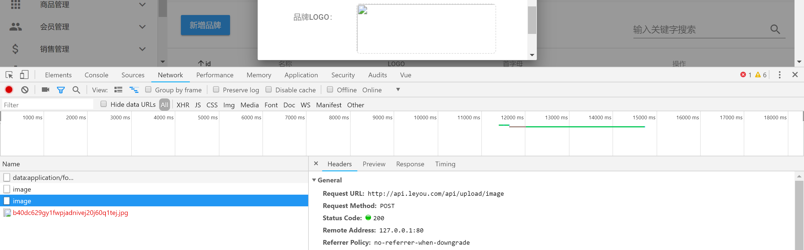

上传没问题，但是图片打不开。配置FastDFS。

## 无配置FastDFS的环境。无后续视频。只能按照笔记实现。目前暂停。


