# 配置CAS客户端

## 下载cas-server-webapp-4.0.0.war包

重命名为cas.war放在tomcat的webapps下面

启动tomcat/bin/startup.bat。然后关闭。

给cas/lib添加三个jar包。

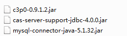

在tomcat/webapps/cas/WEB-INF中做配置。

cas.properties中配置

```xml
server.name=http://localhost:9100
```

cas-servlet.xml中配置

将false改为true允许登出跳页面

```xml
  <bean id="logoutAction" class="org.jasig.cas.web.flow.LogoutAction"
        p:servicesManager-ref="servicesManager"
        p:followServiceRedirects="${cas.logout.followServiceRedirects:true}" />
```

在deployerConfigContext.xml中添加配置mysql数据源

```xml
<!--自己配的mysql数据源-->
	<bean id="dataSource" class="com.mchange.v2.c3p0.ComboPooledDataSource"  
			  p:driverClass="com.mysql.jdbc.Driver"  
			  p:jdbcUrl="jdbc:mysql://127.0.0.1:3306/pinyougoudb?characterEncoding=utf8"  
			  p:user="root"  
			  p:password="root" /> 
			  
	<bean id="passwordEncoder" 
			class="org.jasig.cas.authentication.handler.DefaultPasswordEncoder"  
			c:encodingAlgorithm="MD5"  
			p:characterEncoding="UTF-8" />  
			
	<bean id="dbAuthHandler"  
			  class="org.jasig.cas.adaptors.jdbc.QueryDatabaseAuthenticationHandler"  
			  p:dataSource-ref="dataSource"  
			  p:sql="select password from tb_user where username = ?"  
			  p:passwordEncoder-ref="passwordEncoder"/>  
```

这里替换成我的handler

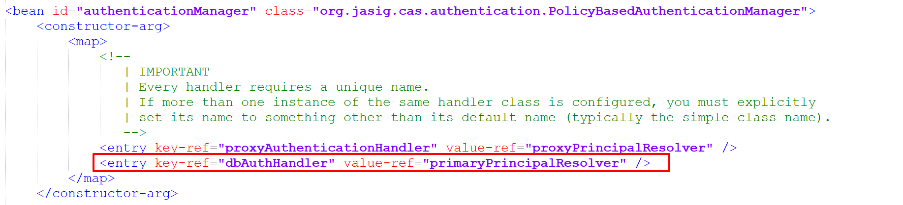


# 起一个maven项目

pom配置

```xml
<?xml version="1.0" encoding="UTF-8"?>
<project xmlns="http://maven.apache.org/POM/4.0.0"
         xmlns:xsi="http://www.w3.org/2001/XMLSchema-instance"
         xsi:schemaLocation="http://maven.apache.org/POM/4.0.0 http://maven.apache.org/xsd/maven-4.0.0.xsd">
    <modelVersion>4.0.0</modelVersion>

    <groupId>cn.itcast.demo</groupId>
    <artifactId>casclient_demo1</artifactId>
    <version>1.0-SNAPSHOT</version>
    <packaging>war</packaging>

    <dependencies>
        <!-- cas -->
        <dependency>
            <groupId>org.jasig.cas.client</groupId>
            <artifactId>cas-client-core</artifactId>
            <version>3.3.3</version>
        </dependency>

        <dependency>
            <groupId>javax.servlet</groupId>
            <artifactId>servlet-api</artifactId>
            <version>2.5</version>
            <scope>provided</scope>
        </dependency>
    </dependencies>

    <build>
        <plugins>
            <plugin>
                <groupId>org.apache.maven.plugins</groupId>
                <artifactId>maven-compiler-plugin</artifactId>
                <version>2.3.2</version>
                <configuration>
                    <source>1.7</source>
                    <target>1.7</target>
                </configuration>
            </plugin>
            <plugin>
                <groupId>org.apache.tomcat.maven</groupId>
                <artifactId>tomcat7-maven-plugin</artifactId>
                <configuration>
                    <!-- 指定端口 -->
                    <port>9001</port>
                    <!-- 请求路径 -->
                    <path>/</path>
                </configuration>
            </plugin>
        </plugins>
    </build>

</project>
```

web.xml

```xml
<?xml version="1.0" encoding="UTF-8"?>
<web-app xmlns:xsi="http://www.w3.org/2001/XMLSchema-instance"
	xmlns="http://java.sun.com/xml/ns/javaee"
	xsi:schemaLocation="http://java.sun.com/xml/ns/javaee http://java.sun.com/xml/ns/javaee/web-app_2_5.xsd"
	version="2.5">	
	
	<!-- ======================== 单点登录开始 ======================== -->  
    <!-- 用于单点退出，该过滤器用于实现单点登出功能，可选配置 -->  
    <listener>  
        <listener-class>org.jasig.cas.client.session.SingleSignOutHttpSessionListener</listener-class>  
    </listener>  
  
    <!-- 该过滤器用于实现单点登出功能，可选配置。 -->  
    <filter>  
        <filter-name>CAS Single Sign Out Filter</filter-name>  
        <filter-class>org.jasig.cas.client.session.SingleSignOutFilter</filter-class>  
    </filter>  
    <filter-mapping>  
        <filter-name>CAS Single Sign Out Filter</filter-name>  
        <url-pattern>/*</url-pattern>  
    </filter-mapping>  
  
    <!-- 该过滤器负责用户的认证工作，必须启用它 -->  
    <filter>  
        <filter-name>CASFilter</filter-name>  
        <filter-class>org.jasig.cas.client.authentication.AuthenticationFilter</filter-class>  
        <init-param>  
            <param-name>casServerLoginUrl</param-name>  
            <param-value>http://localhost:9100/cas/login</param-value>
            <!--这里的server是服务端的IP -->  
        </init-param>
        <init-param>  
            <param-name>serverName</param-name>  
            <param-value>http://localhost:9001</param-value>
        </init-param>
    </filter>  
    <filter-mapping>  
        <filter-name>CASFilter</filter-name>  
        <url-pattern>/*</url-pattern>  
    </filter-mapping>  
  
    <!-- 该过滤器负责对Ticket的校验工作，必须启用它 -->  
    <filter>  
        <filter-name>CAS Validation Filter</filter-name>  
        <filter-class>  
            org.jasig.cas.client.validation.Cas20ProxyReceivingTicketValidationFilter</filter-class>  
        <init-param>  
            <param-name>casServerUrlPrefix</param-name>  
            <param-value>http://localhost:9100/cas</param-value>
        </init-param>  
        <init-param>  
            <param-name>serverName</param-name>  
            <param-value>http://localhost:9001</param-value>
        </init-param>  
    </filter>  
    <filter-mapping>  
        <filter-name>CAS Validation Filter</filter-name>  
        <url-pattern>/*</url-pattern>  
    </filter-mapping>  
  
    <!-- 该过滤器负责实现HttpServletRequest请求的包裹， 比如允许开发者通过HttpServletRequest的getRemoteUser()方法获得SSO登录用户的登录名，可选配置。 -->  
    <filter>  
        <filter-name>CAS HttpServletRequest Wrapper Filter</filter-name>  
        <filter-class>  
            org.jasig.cas.client.util.HttpServletRequestWrapperFilter</filter-class>  
    </filter>  
    <filter-mapping>  
        <filter-name>CAS HttpServletRequest Wrapper Filter</filter-name>  
        <url-pattern>/*</url-pattern>  
    </filter-mapping>  
  
    <!-- 该过滤器使得开发者可以通过org.jasig.cas.client.util.AssertionHolder来获取用户的登录名。 比如AssertionHolder.getAssertion().getPrincipal().getName()。 -->  
    <filter>  
        <filter-name>CAS Assertion Thread Local Filter</filter-name>  
        <filter-class>org.jasig.cas.client.util.AssertionThreadLocalFilter</filter-class>  
    </filter>  
    <filter-mapping>  
        <filter-name>CAS Assertion Thread Local Filter</filter-name>  
        <url-pattern>/*</url-pattern>  
    </filter-mapping>  
  
    <!-- ======================== 单点登录结束 ======================== -->  
	
	
</web-app>
```

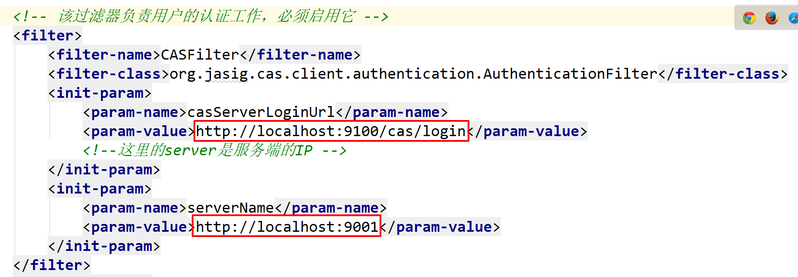

## 测试

访问我的localhost:9001就会到localhost:9100/cas/login进行认证

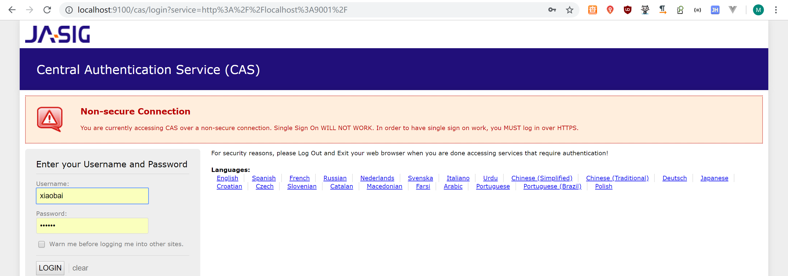

# 服务端界面改造

拷贝品优购登录页面到，原来的文件重命名为casLoginView.jsp.html

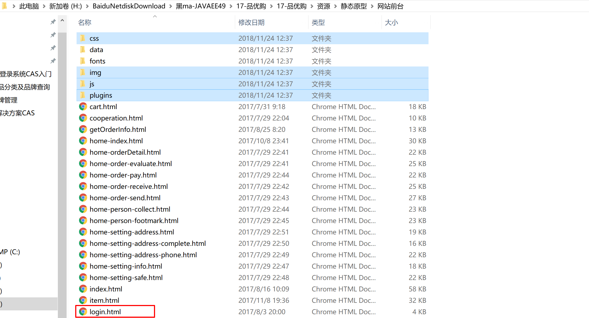

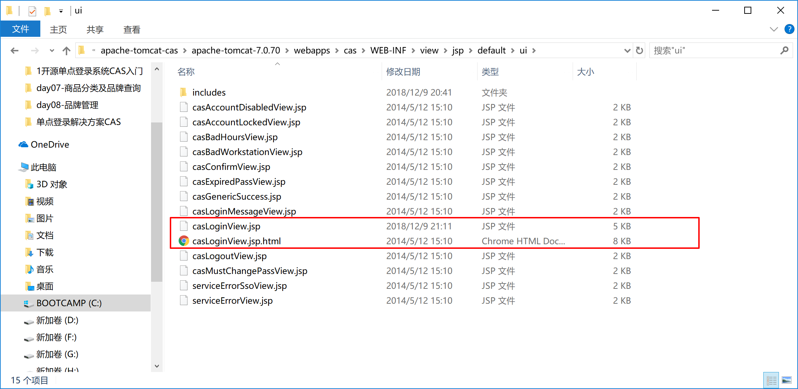

将其他文件拷贝到cas下

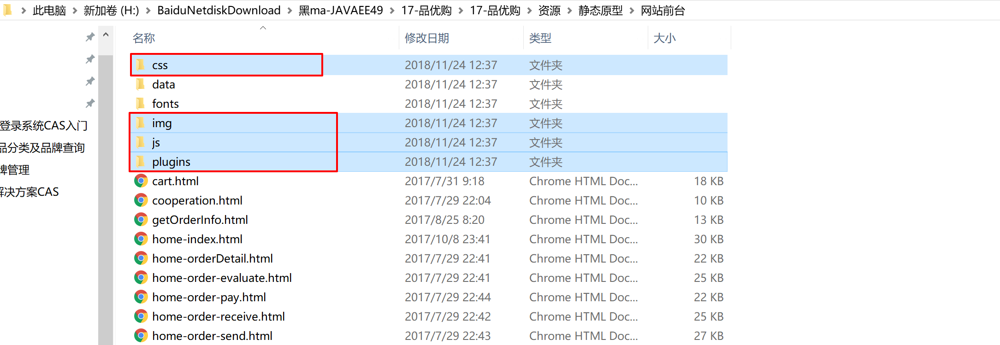

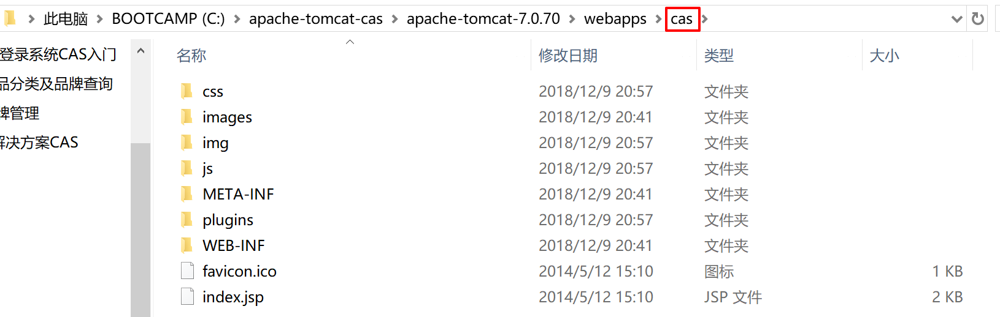


casLoginView.jsp改造为

```html
<!DOCTYPE html>
<%@ page pageEncoding="UTF-8" %>
<%@ page contentType="text/html; charset=UTF-8" %>
<%@ taglib prefix="c" uri="http://java.sun.com/jsp/jstl/core" %>
<%@ taglib prefix="spring" uri="http://www.springframework.org/tags" %>
<%@ taglib prefix="form" uri="http://www.springframework.org/tags/form" %>
<%@ taglib prefix="fn" uri="http://java.sun.com/jsp/jstl/functions" %>
<html>

<head>
	<meta charset="UTF-8">
	<meta http-equiv="X-UA-Compatible" content="IE=9; IE=8; IE=7; IE=EDGE">
	<meta http-equiv="X-UA-Compatible" content="IE=EmulateIE7" />
	<title>品优购，欢迎登录</title>

    <link rel="stylesheet" type="text/css" href="css/webbase.css" />
    <link rel="stylesheet" type="text/css" href="css/pages-login.css" />
</head>

<body>
	<div class="login-box">
		<!--head-->
		<div class="py-container logoArea">
			<a href="" class="logo"></a>
		</div>
		<!--loginArea-->
		<div class="loginArea">
			<div class="py-container login">
				<div class="loginform">
					<ul class="sui-nav nav-tabs tab-wraped">
						<li>
							<a href="#index" data-toggle="tab">
								<h3>扫描登录</h3>
							</a>
						</li>
						<li class="active">
							<a href="#profile" data-toggle="tab">
								<h3>账户登录</h3>
							</a>
						</li>
					</ul>
					<div class="tab-content tab-wraped">
						<div id="index" class="tab-pane">
							<p>二维码登录，暂为官网二维码</p>
							
						</div>
						<div id="profile" class="tab-pane  active">
							<!--<form class="sui-form">-->
							<form:form class="sui-form" method="post" id="fm1" commandName="${commandName}" htmlEscape="true">
								<div class="input-prepend"><span class="add-on loginname"></span>
									<!--<input id="prependedInput" type="text" placeholder="邮箱/用户名/手机号" class="span2 input-xfat">-->
									<form:input placeholder="邮箱/用户名/手机号" class="span2 input-xfat" id="username" size="25" tabindex="1" accesskey="${userNameAccessKey}" path="username" autocomplete="off" htmlEscape="true" />
								</div>
								<div class="input-prepend"><span class="add-on loginpwd"></span>
									<!--<input id="prependedInput" type="password" placeholder="请输入密码" class="span2 input-xfat">-->
									<form:password placeholder="请输入密码" class="span2 input-xfat" id="password" size="25" tabindex="2" path="password"  accesskey="${passwordAccessKey}" htmlEscape="true" autocomplete="off" />
								</div>
								<div class="setting">
									<label class="checkbox inline">
          <input name="m1" type="checkbox" value="2" checked=""> 
          自动登录
        </label>
									<span class="forget">忘记密码？</span>
								</div>
								<div class="logined">
									<!--<a class="sui-btn btn-block btn-xlarge btn-danger" href="home-index.html" >登&nbsp;&nbsp;录</a>-->
									
									<input type="hidden" name="lt" value="${loginTicket}" />
								    <input type="hidden" name="execution" value="${flowExecutionKey}" />
								    <input type="hidden" name="_eventId" value="submit" />

								    <input class="sui-btn btn-block btn-xlarge btn-danger" name="submit" accesskey="l" value="登&nbsp;&nbsp;录" tabindex="4" type="submit" />
								</div>
							<!--</form>-->
							</form:form>
							<div class="otherlogin">
								<div class="types">
									<ul>
										<li></li>
										<li></li>
										<li></li>
										<li></li>
									</ul>
								</div>
								<span class="register"><a href="register.html" target="_blank">立即注册</a></span>
							</div>
						</div>
					</div>
				</div>
			</div>
		</div>
		<!--foot-->
		<div class="py-container copyright">
			<ul>
				<li>关于我们</li>
				<li>联系我们</li>
				<li>联系客服</li>
				<li>商家入驻</li>
				<li>营销中心</li>
				<li>手机品优购</li>
				<li>销售联盟</li>
				<li>品优购社区</li>
			</ul>
			<div class="address">地址：北京市昌平区建材城西路金燕龙办公楼一层 邮编：100096 电话：400-618-4000 传真：010-82935100</div>
			<div class="beian">京ICP备08001421号京公网安备110108007702
			</div>
		</div>
	</div>

<script type="text/javascript" src="js/plugins/jquery/jquery.min.js"></script>
<script type="text/javascript" src="js/plugins/jquery.easing/jquery.easing.min.js"></script>
<script type="text/javascript" src="js/plugins/sui/sui.min.js"></script>
<script type="text/javascript" src="js/plugins/jquery-placeholder/jquery.placeholder.min.js"></script>
<script type="text/javascript" src="js/pages/login.js"></script>
</body>

</html>
```

## 测试

重启tomcat/bin。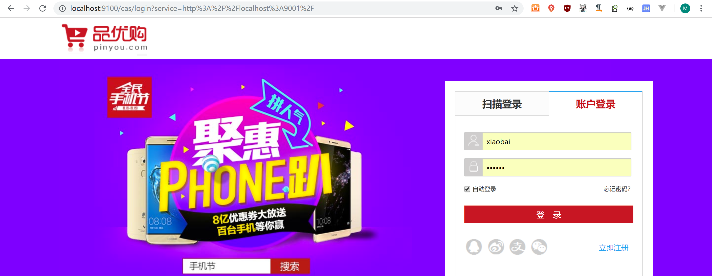

修改错误提示

在casLoginView.jsp中的忘记密码下面添加

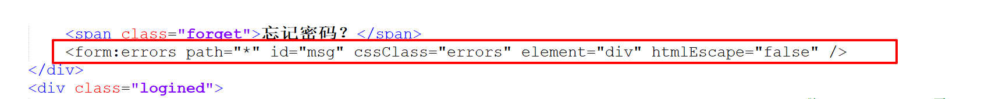

```html
<form:errors path="*" id="msg" cssClass="errors" element="div" htmlEscape="false" />
```

在messages_zh_CN.properties中最下面添加

```properties
authenticationFailure.AccountNotFoundException=\u7528\u6237\u540d\u6216\u5bc6\u7801\u9519\u8bef.
authenticationFailure.FailedLoginException=\u7528\u6237\u540d\u6216\u5bc6\u7801\u9519\u8bef.
```

修改cas-servlet.xml

```xml
<bean id="localeResolver" class="org.springframework.web.servlet.i18n.CookieLocaleResolver" p:defaultLocale="zh_CN" />
```

改为zh_CN

测试

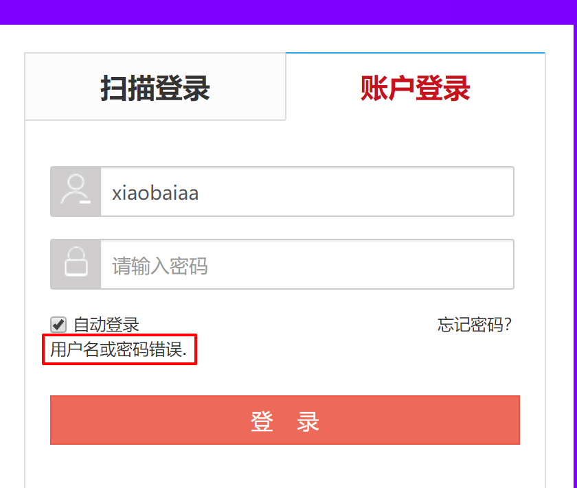


文件上传到github上了

https://github.com/woshiamiaojiang/projects/tree/master/casclient_demo1

https://github.com/woshiamiaojiang/projects/blob/master/apache-tomcat-cas.7


