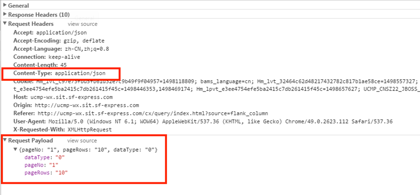
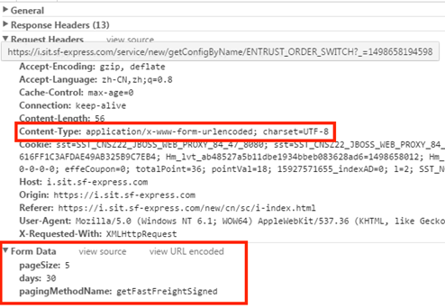

## 接口定义规范

## 路径URL规则:

<http://ccsp-int-apigw.intsit.sfdc.com.cn:1080/ccspMember/addressBook/queryAddressPage>

规范1：系统名称必须在项目内唯一

规范2：服务名称必须系统内唯一

规范3：服务接口类路径(@Path) 必须与服务配置结点中document值相同

规范4：方法必须为@POST形式，且必须定义@Path路径

## application/json



```java
数据格式：
{
    "dataType": "0",
    "pageNo": "1",
    "pageRows": "10"
}

```

## application/x-www-form-urlencoded



## Result

```java
返回数据分装类
public class Result<T> implements Serializable {

    private static final long serialVersionUID = 1L;

    private String requestId;

    /**
     * 操作是否成功
     */
    private boolean success = false;
    /**
     * 业务编码
     */
    private Integer business;
    /**
     * 错误提示码
     */
    private String errorCode;
    /**
     * 错误提示信息
     */
    private String errorMessage;
    /**
     * 服务器時間
     */
    private String date;
    /**
     * 服务器版本
     */
    private String version;

    /**
     * 结果对象
     */
    private T obj;
}

```

分页类

```java
public class Page<T> implements Serializable {

    private static final long serialVersionUID = -3878115558559468504L;

    private int currentPage = 1; // 当前页

    private int pageSize = 20; //每页显示记录数

    private int startRecord = 1; //起始查询记录

    private int totalPage = 0; //总页数

    private int totalRecord = 0; //总记录数

    private List<T> datas;
}

```

##  返回数据：

Result<T>

```java
1、根据城市名称获取城市location_code:
Result<String>

2、根据城市编码获取城市信息：
Result<AddressResp>

3、获取热门城市信息:
Result<List<AddressResp>>

4、根据memberId查询偏好信息(分页):
Result<Page<DeliveryPreference>>

5、当返回数据是多个字符串，或者不同对象时
Result<Map<String, Object>>

```

## 正确方式：

```java
@POST
@Path("queryAddress")
public Result<ArrayList<AddressBookResp>> queryAddress(AddressBookReq reqInfo);

public Result<ArrayList<AddressBookResp>> queryAddress(AddressBookReq reqInfo) {
    Result<ArrayList<AddressBookResp>> result = new Result<>(false);
    ArrayList<AddressBookResp> addressBookInfo = null;
   
    业务逻辑

    result.setSuccess(true);
    result.setObj(addressBookInfo);
    return result;
}
```

## 常见接口示例规范:

```java
public Result<String> queryLocationCodeByFullName(String cityName);

public Result<AddressResp> queryAreaInfoByAreaCode(AddressGetReq addressGetReq);

public Result<List<AddressResp>> getHotCity();

public Result<Page<DeliveryPreference>> queryDelivery(DeliveryPreferenceReq deliveryPreferenceReq);

public Result<Map<String, Object>> queryAddressPage(AddressBookReq reqInfo);

public Result<String> addAddress(AddressBookAddReq address);

public Result<String> batchAddAddress(List<AddressBookAddReq> addressList);

public Result<Page<AddressResp>> queryAddressPage(String memberId,String currentPage,String pageSize);

```

## 微服务接口

```java
@Path("users")
@Consumes({MediaType.APPLICATION_JSON, MediaType.TEXT_XML})
@Produces({MediaType.APPLICATION_JSON + "; " + MediaType.CHARSET_PARAMETER + "=UTF-8", MediaType.TEXT_XML + "; " + MediaType.CHARSET_PARAMETER + "=UTF-8"})
@Api("Demo-api")
public interface DemoRestService {
    @GET
    @Path("{id : \\d+}")
    @ApiOperation(value="通过主键获取用户信息")
    Demo getDemo(@PathParam("id") @Min(1) Integer id);
}
```


## 错误码说明

错误码规则
CCSP-APP-XXXXX
统一以CCSP开头，APP代表应用名称,XXXXX错误码编号 错误码长度为5-6位数

错误码规则说明


错误码类型
错误码分为系统级别错误码和服务级错误代码，1开头的均为系统错误码
系统级错误码：系统级别错误码主要用于发生系统错误（如系统无法访问数据库、无法连接第三方服务）
服务级错误代码：主要用于自己业务及验证


